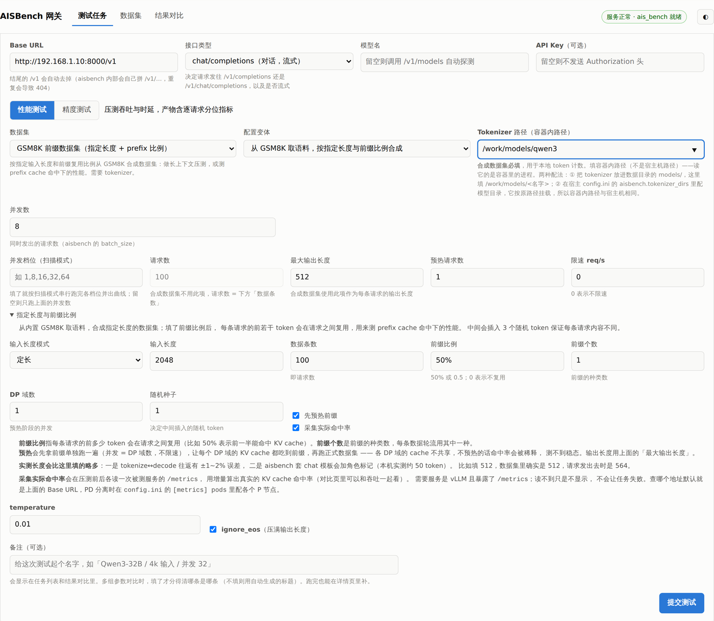
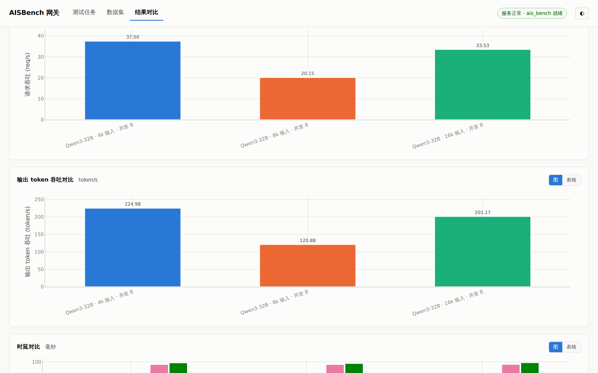
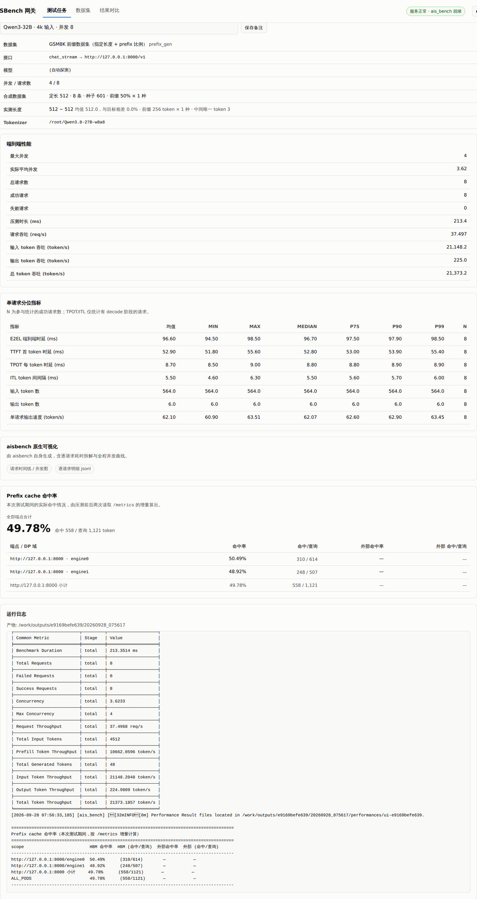

# AISBench 网关

把 [AISBench](https://github.com/AISBench/benchmark) 那套「手写 mmengine 配置 + 拼一长串
CLI 参数 + 去 `outputs/` 里翻 JSON」的流程，包成一个网页表单：填模型服务地址、选数据集、
点提交，结果自动入库并能叠图对比。



- **不需要懂 aisbench**，不需要写配置文件
- **不需要在宿主机装 Python** —— 网关跑在容器里，用的是容器自带的 Python
- 零第三方依赖，全部标准库

---

## 快速开始

### 前提

只有一个：**Docker**（20.10+，能跑容器就行）。

### 1. 克隆

```bash
git clone https://github.com/shijunan126-creator/aisbench-gateway.git
cd aisbench-gateway
```

### 2. 拉 aisbench 镜像

镜像在华为云公开仓库上，几 GB，第一次要等一会儿：

```bash
docker pull swr.cn-south-1.myhuaweicloud.com/ascendhub/aisbench_benchmark:v3.1-20260630-master-ubuntu22.04-py310
```

镜像本身是**多平台**的（amd64 / arm64 都有），`docker pull` 会自动取匹配你机器的那个，
x86 和鲲鹏/昇腾机器都能原生跑。

> 不联网的机器怎么办？见下面「[做成离线交付包](#做成离线交付包)」。

### 3. 启动

```bash
./start.sh
```

会在数据目录下生成 `data/`（产物、数据集），并从 `config.ini.example` 生成一份
`config.ini`。最后打印访问地址。

### 4. 打开页面

浏览器访问 `http://<本机IP>:8080`（`./status.sh` 会打印具体地址）。

### 5. 下载数据集

**刚克隆下来只有两个数据集能用**：内置的「随机数据集」和「GSM8K 前缀数据集」（都是现场生成的，
不需要磁盘数据）。其余的要去**「数据集」页**点下载 —— 这一步需要联网。

### 6. 跑第一个测试

**手边没有真实模型服务？** 仓库带了一个假模型服务，可以直接把流程走通：

```bash
./tools/run_mock_server.sh          # 起在 127.0.0.1:8000
```

然后在页面上：Base URL 填 `http://127.0.0.1:8000/v1`，接口类型选
`chat/completions（对话，流式）`，数据集选「随机数据集」，点「提交测试」。

它返回的是随机词，**精度得分没有意义**，只用来验证链路和看界面。
（假模型服务仅用于开发自测，不进交付包。）

---

## 功能

### 精度测试

选数据集，提交，跑完在详情页看各数据集得分。

### 性能测试

选定并发下的吞吐与时延。产物含逐请求分位指标（E2EL / TTFT / TPOT / ITL 的
均值、P75/P90/P99 等）。

### 并发梯度扫描

「并发档位」填 `1,8,16,32,64`，会逐档串行跑完并画出「并发-吞吐」「并发-时延」曲线，
用来找吞吐拐点。

### 结果对比

多条运行记录勾选后叠图对比。**给运行写「备注」**，图表里就会显示备注而不是自动标题 ——
对比多组参数时这是刚需。



### 指定长度 / prefix cache 测试

数据集选「**GSM8K 前缀数据集**」，会从内置 GSM8K 取语料，合成出**长度由你指定**、
**前缀按比例复用**的数据：

- **长上下文压测**：真实数据集的 prompt 长度是固定的，压不了 32k/128k
- **prefix cache 命中率**：填「前缀比例」50%，则每条请求的前一半在请求间相同

还可以勾上「采集实际命中率」，网关会在压测前后各读一次被测服务的 `/metrics`，
用增量算出**真实**的 KV cache 命中率，按 DP 域分别列出，并并进结果里与吞吐一起对比。

### 任务详情



---

## 关于 tokenizer

**随机数据集、sharegpt、合成数据集**需要一个**本地 tokenizer** 才能跑
（用来做 token 计数 / 把文本调整到指定 token 长度）。aisbench 镜像里一个都不带。

两种配法：

1. **推荐**：把 tokenizer 目录放进 `data/models/`，页面上填 `/work/models/<目录名>`。
   这种方式随数据目录一起搬走，不用改配置。
2. 编辑 `config.ini` 的 `tokenizer_dirs`，填**宿主机**上的模型目录（会按原路径挂进容器），
   然后 `./stop.sh && ./start.sh`。

其余数据集（gsm8k / mmlu / ceval / math 等）不需要 tokenizer。

---

## 常用命令

```bash
./start.sh            启动（后台常驻，开机自启）
./stop.sh             停止（保留容器，下次启动更快）
./stop.sh --purge     停止并删除容器（数据不受影响）
./status.sh           状态与诊断
./run.sh              前台运行，实时看日志
docker logs -f aisbench-gateway     看实时日志
```

改 `config.ini` 后需要 `./stop.sh && ./start.sh` 生效。
改前端（`static/`）不用重启，静态文件每次请求现读。

---

## 配置

`config.ini`（首次运行自动从 `config.ini.example` 生成）：

| 段 | 键 | 说明 |
|---|---|---|
| `[server]` | `host` / `port` | 监听地址与端口，默认 `0.0.0.0:8080` |
| `[aisbench]` | `image` | aisbench 镜像；升级时改这里再 `./stop.sh && ./start.sh` |
| `[aisbench]` | `tokenizer_dirs` | 宿主机的 tokenizer 目录，逗号分隔 |
| `[metrics]` | `pods` | 采集命中率时查哪些 `/metrics`。留空=用被测服务自己；PD 分离时填各 P 节点 |
| `[runner]` | `stall_timeout` | 无输出看门狗（秒）。卡死任务会被自动终止 |
| `[defaults]` | — | 前端表单的初始值 |

---

## 目录结构

```
gw/          后端（纯标准库）
static/      前端（原生 JS + vendored plotly，无构建步骤）
tools/       开发自测用的假模型服务
docs/        文档用图

install.sh / start.sh / stop.sh / status.sh    运维脚本
run.sh / lib.sh                                前台运行 / 脚本共用函数
make-release.sh                                开发侧打包（产出离线交付包）

data/        运行时数据（gitignore）
  ├── configs/     每次任务生成的 mmengine 配置
  ├── outputs/     任务产物
  ├── datasets/    下载的数据集
  ├── generated/   合成出来的数据集
  └── models/      tokenizer
```

`data/` 是读写挂载进容器的（`/work`），代码目录是只读挂载（`/gateway`）。
所以升级代码或改配置都不用动镜像。

---

## 做成离线交付包

客户机器不能联网时，用 `make-release.sh` 打一个「解压 → 跑 `./install.sh`」的包：

```bash
./make-release.sh                       # 默认打 arm64
./make-release.sh --platform linux/amd64
./make-release.sh --datasets gsm8k,ceval
```

包里含镜像、预置数据集和一套运维脚本，客户机上**只需要 Docker**。

> 包里的镜像会被裁成**单平台**。原因：`docker save` 一个多平台 tag 会产出「混合」tar，
> 其中 `manifest.json` 只写打包机那一个平台，而经典存储（overlay2）的 `docker load`
> 只读它 —— 不裁的话，在 x86 上打出来的包拿到 arm64 客户机上会 load 出 amd64 镜像，
> 容器直接起不来。细节见 [`DEVELOPING.md`](DEVELOPING.md)。

---

## 开发

改代码前请先读 [`DEVELOPING.md`](DEVELOPING.md)，那里记了改 aisbench 相关代码的坑
（mmengine 配置不能调函数、`--num-prompts` 会被静默忽略、产物解析的两个坑……），
都是实测踩出来的。

面向交付包使用者的说明在 [`README.customer.md`](README.customer.md)。

---

## 已知问题

- **aisbench 偶发卡死**：卡在 `Launch TasksMonitor` 之后，日志再无输出、CPU 时间不再增长。
  原因未定。网关有看门狗（`runner.stall_timeout`，默认 900 秒）会自动终止，不会堵住队列。
- 交付包里的镜像被裁成单平台，**架构必须和客户机器匹配**，否则 `install.sh` 会直接报错退出。

---

## License

[MIT](LICENSE)
